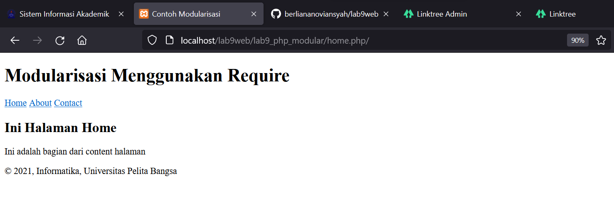
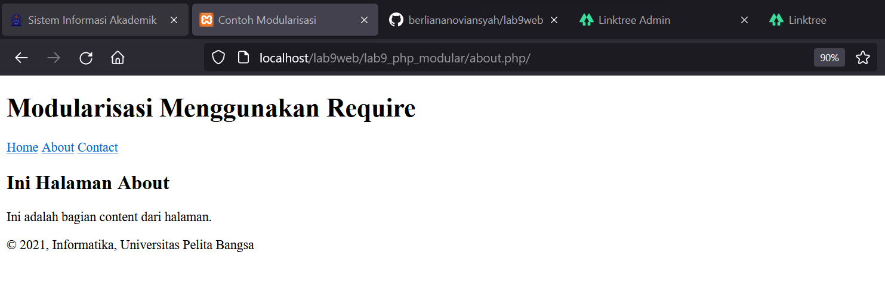

|  Berliana Noviansyah  |      312010373     |
|-----------------------|--------------------|
|    Pemrograman Web    |      TI.20.A1      |
|     Pertemuan 11      |  Praktikum 9 & 10  |

# Praktikum 9 & 10 Pertemuan 11

## 1). Menjalankan Xampp Server

Langkah pertama yang harus dilakukan adalah menjalankan apache dan mysql pada aplikasi xampp server.


## 2) Membuat Folder Baru

Lalu buatlah folder baru didalam folder *lab9web* dengan nama *lab9_php_modular*
Kemudian jalankan pada localhost server dengan mengakses http://localhost/lab9web/lab9_php_modular/


## 3). Membuat File

Setelahnya, buatlah file baru dengan nama header.php di dalam folder lab9_php modular. Lalu buat header seperti pada contoh dibawah ini:

```html
<!DOCTYPE html>
<html lang="en">
<head>
    <meta charset="UTF-8">
    <meta http-equiv="X-UA-Compatible" content="IE=edge">
    <meta name="viewport" content="width=device-width, initial-scale=1.0">
    <title>Contoh Modularisasi</title>
</head>
<body>
    <div class="container">
        <header>
            <h1>Modularisasi Menggunakan Require</h1>
        </header>
        <nav>
            <a href="home.php">Home</a>
            <a href="about.php">About</a>
            <a href="kontak.php">Contact</a>
        </nav>
```

## 4). Membuat Footer

Setelah membuat header, lanjut untuk membuat footer dengan membuat file baru dengan nama *footer.php* di dalam folder lab9_php_modular.

```html
<footer>
        <p>&copy; 2021, Informatika, Universitas Pelita Bangsa</p>
    </footer>
    </div>
</body>
</html>
```


## 5). Membuat Home

Buatlah file dengan nama *home.php* di dalam folder lab9_php_modular. Lalu masukan codingan berikut:

```html
<?php require('header.php'); ?>

<div class="content">
    <h2>Ini Halaman Home</h2>
    <p>Ini adalah bagian dari content halaman</p>
</div>

<?php require('footer.php'); ?>
```


## 6). Membuat Halaman 'About'

Sama seperti sebelumnya, buatlah file dengan nama *about.php* di dalam folder lab9_php_modular. Lalu masukan coding berikut:

```html
<?php require('header.php'); ?>

<div class="content">
    <h2>Ini Halaman About</h2>
    <p>Ini adalah bagian content dari halaman.</p>
</div>

<?php require('footer.php'); ?>
```


## Berikut adalah tampilan pada halaman:

**HOME**




**ABOUT**




# Laporan dan Tugas

Implementasikan konsep modularisasi pada kode program **Praktikum 8** tentang database, sehingga setiap halamannya memiliki template yang sama.